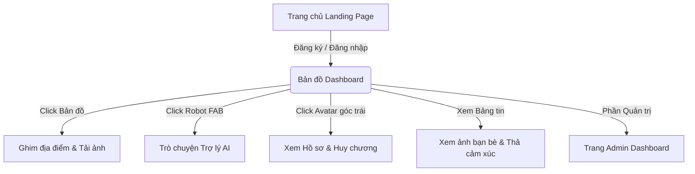

# BÁO CÁO ĐỀ TÀI: XÂY DỰNG ỨNG DỤNG BẢN ĐỒ KÝ ỨC DU LỊCH (TRAVEL MEMORY MAP)

*Tài liệu hướng dẫn sử dụng và thuyết minh dự án dành cho Hội đồng Đánh giá / Giảng viên hướng dẫn.*

---

## 📝 GIỚI THIỆU ĐỀ TÀI

### 1. Ý tưởng đề tài
Trong thời đại số hóa, nhu cầu ghi lại hành trình xê dịch cá nhân ngày càng lớn. **Travel Memory Map** ra đời nhằm mục đích giúp người dùng số hóa các chuyến đi, ghim ảnh kỷ niệm trực quan trên bản đồ địa lý, kết nối giao lưu với bạn bè, đồng thời ứng dụng công nghệ Trí tuệ nhân tạo (AI) để giải quyết các bài toán lập lịch trình và tư vấn du lịch thực tế.

### 2. Mục tiêu đề tài
* **Về mặt công nghệ:** Ứng dụng mô hình kiến trúc MVC trong phát triển Web bằng PHP thuần, tích hợp thư viện bản đồ nguồn mở Leaflet.js và API của Google Gemini để nâng cao trải nghiệm ứng dụng thông minh.
* **Về mặt thực tiễn:** Tạo ra một ứng dụng hoàn thiện có đầy đủ các luồng hoạt động từ Đăng nhập, Tương tác bản đồ, Mạng xã hội, Hệ thống tăng cấp/Huy chương (Gamification) và Trợ lý ảo AI.

---

## 🖥️ HƯỚNG DẪN TRẢI NGHIỆM CHỨC NĂNG (Dành cho Giảng viên)

### 📌 Phần 1: Tài khoản trải nghiệm mặc định
Giảng viên có thể đăng ký tài khoản mới trong 30 giây ngay tại giao diện đăng ký, hoặc sử dụng các tài khoản mẫu sau để kiểm tra nhanh:
1. **Tài khoản Quản trị viên (Admin):**
   * **Username:** `admin`
   * **Password:** `Admin@123`
2. **Tài khoản Người dùng (User):**
   * Giảng viên có thể đăng ký trực tiếp một tài khoản User bất kỳ qua nút **Đăng ký** trên trang chủ.

---

### 📌 Phần 2: Luồng trải nghiệm và Hướng dẫn sử dụng



#### 1. Đăng ký & Đăng nhập tài khoản
* Truy cập trang chủ, nhấn **Đăng nhập** hoặc **Đăng ký**.
* Hệ thống quản lý tài khoản bảo mật bằng thuật toán băm mật khẩu `password_hash` (BCRYPT) an toàn chống tấn công dò mật khẩu.

#### 2. Thao tác trên Bản đồ Ký ức (Dashboard)
* **Ghim kỷ niệm mới:** Nhấp chuột (hoặc chạm tay trên điện thoại) trực tiếp vào bất kỳ vị trí nào trên bản đồ. Một form **Lưu Giữ Kỷ Niệm** sẽ hiện ra. Nhập tên địa điểm, ngày ghé thăm, cảm xúc (vui, buồn, hạnh phúc...) và tải lên ảnh/video. Nhấn **Lưu kỷ niệm**. Một Marker chứa hình ảnh nhỏ của bạn sẽ hiện ra trực quan ngay tại điểm đó trên bản đồ.
* **Đổi giao diện bản đồ:** Sử dụng cụm phím tròn nổi bên phải bản đồ để đổi nhanh sang chế độ bản đồ **Tối (Dark Mode)**, **Sáng (Light Mode)** hoặc **Vệ tinh (Satellite)**.
* **Bộ lọc bản đồ:** Nhấn biểu tượng phễu lọc để chỉ hiển thị các ký ức theo chuyến đi hoặc theo trạng thái cảm xúc (ví dụ: chỉ hiện các điểm check-in "Bình yên").
* **Định vị GPS:** Nhấn biểu tượng hồng tâm để tự động tìm kiếm vị trí thực tế của bạn trên bản đồ.

#### 3. Tương tác Mạng xã hội (Locket Feed)
* Cuộn xuống dưới bản đồ là khu vực **Bảng tin (Feed)**. Nơi đây hiển thị các hình ảnh Locket của bạn và bạn bè của bạn.
* **Thả cảm xúc động:** Rê chuột vào nút thích để hiển thị menu cảm xúc sinh động (👍, ❤️, 😂, 😮, 😢). Khi click sẽ kích hoạt hiệu ứng pháo hoa cảm xúc (Emoji Burst) bay nhảy đẹp mắt.
* **Nhắn tin riêng tư:** Ngay dưới mỗi bài viết của bạn bè, bạn có thể gửi tin nhắn trò chuyện trực tiếp với họ.

#### 4. Hệ thống Tăng cấp & Mở khóa Huy chương
* Nhấn vào **Ảnh đại diện** ở góc trên bên trái bản đồ để mở cửa sổ **Hành trang**.
* Tại đây hiển thị điểm Kinh nghiệm tích lũy (XP). Khi bạn thực hiện các hoạt động ghim điểm hoặc tương tác, điểm XP sẽ tăng lên và thăng cấp (ví dụ: từ *Tân binh xê dịch* lên *Thánh Check-in*).
* **Mở khóa Huy chương:** Hệ thống sẽ tự động theo dõi hành vi và mở khóa huy chương tương ứng (ví dụ: Ghé thăm 3+ địa điểm mở khóa huy chương *Thám hiểm*; check-in sau 22h tối mở khóa huy chương *Cú đêm*...). Các huy chương bị khóa sẽ có biểu tượng ổ khóa xám.

#### 5. Khám phá Trợ lý AI Thông minh
* Nhấn vào nút tròn nổi có biểu tượng **Robot 🤖** (hoặc nút Chat trên bản đồ) ở góc dưới bên phải màn hình để mở khung chat **Travel Memory AI**.
* **Nhập câu hỏi tự do:** Ví dụ: *"Lịch trình 3 ngày 2 đêm ở Hà Giang"*, *"Ăn gì ngon ở Đà Lạt?"*, *"Viết hộ caption chill ghim lên bản đồ đi biển"*.
* **Sử dụng phím tắt nhanh:** Nhấp vào các thẻ gợi ý nhanh (như *Lộ trình Hà Giang*, *Sài Gòn - Đà Lạt*, *Ẩm thực Hải Dương*,...) để xem cách AI lập kế hoạch nhanh chóng.
* **Cơ chế hoạt động:** Trợ lý sẽ phân tích địa điểm, tự động lấy thông tin thời tiết thời gian thực và gợi ý lịch trình chi tiết (Sáng - Trưa - Chiều - Tối) cực kỳ đúng trọng tâm.

#### 6. Hệ thống dành cho Quản trị viên (Admin)
* Đăng nhập bằng tài khoản `admin` để truy cập trang quản trị.
* Xem biểu đồ thống kê tăng trưởng hệ thống.
* Quản lý thông tin tài khoản người dùng, đổi mật khẩu hoặc phân quyền.
* Theo dõi **Activity Logs** ghi lại toàn bộ hoạt động trong hệ thống (ai vừa ghim điểm, ai vừa kết bạn...) và **Login Logs** phát hiện các thiết bị/trình duyệt đăng nhập trái phép.

---

## 🛠️ CÔNG NGHỆ VÀ KIẾN TRÚC HỆ THỐNG

### 1. Kiến trúc phần mềm (Custom MVC)
Dự án được triển khai theo cấu trúc **Model - View - Controller (MVC)** thuần khiết, giúp mã nguồn mạch lạc, dễ bảo trì:
* **Controller:** Xử lý nghiệp vụ logic, nhận dữ liệu đầu vào và điều phối dữ liệu qua Model để hiển thị lên View (Ví dụ: `LocationController.php`, `AiController.php`).
* **Model:** Tương tác trực tiếp với CSDL qua PDO, thực hiện các truy vấn bảo mật (`LocationModel.php`, `TripModel.php`).
* **View:** Giao diện hiển thị trực quan sử dụng HTML, CSS và JavaScript (`dashboard.php`, `ai_chat.php`).

### 2. Thiết kế Cơ sở dữ liệu (MySQL / MariaDB)
Sơ đồ cơ sở dữ liệu gồm các bảng chính:
* `users`: Lưu trữ thông tin tài khoản, mật khẩu băm, phân quyền và điểm tích lũy XP.
* `locations`: Lưu trữ các tọa độ GPS địa điểm ghim, tên địa danh, hình ảnh, video, cảm xúc và chế độ riêng tư.
* `trips`: Liên kết các địa điểm ghim vào chung một chuyến đi (ví dụ: Tour đi Tây Bắc).
* `friends`: Quản lý danh sách bạn bè, trạng thái lời mời (Pending / Accepted).
* `messages`: Lưu lịch sử nhắn tin riêng tư giữa các tài khoản.
* `activity_logs` & `login_logins`: Lưu nhật ký bảo mật hệ thống.

---

## 🚀 HƯỚNG DẪN CÀI ĐẶT DỰ ÁN TRÊN XAMPP

1. Tải toàn bộ mã nguồn về máy và giải nén đặt vào thư mục `C:\xampp\htdocs\travelmap`.
2. Tạo CSDL tên `travel_memory_map` trong phpMyAdmin và import file SQL mẫu `travel_memory_map_local.sql` đính kèm trong thư mục dự án.
3. Cấu hình file kết nối CSDL tại [config/db_config.php](file:///c:/xampp/htdocs/travel-memory-map/config/db_config.php) cho đúng với tài khoản MySQL cục bộ của bạn.
4. Cấu hình Gemini API Key bằng cách tạo file [config/ai_private.php](file:///c:/xampp/htdocs/travel-memory-map/config/ai_private.php) rồi điền:
   ```php
   <?php
   putenv('GEMINI_API_KEY=MÃ_API_KEY_CỦA_BẠN');
   ```
5. Mở trình duyệt web và truy cập địa chỉ: `http://localhost/travelmap/public/index.php`.

---

*Hội sinh viên & Nhóm phát triển dự án xin trân trọng cảm ơn Thầy Cô đã dành thời gian đánh giá đề tài này!*
